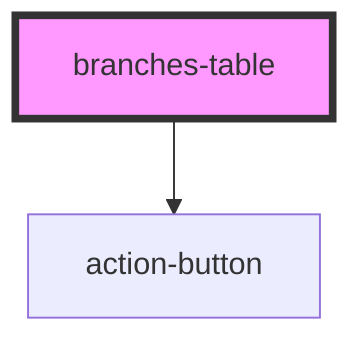

# my-component

<!-- Auto Generated Below -->

## Properties

| Property   | Attribute  | Description | Type     | Default |
| ---------- | ---------- | ----------- | -------- | ------- |
| `branches` | `branches` |             | `string` | `'[]'`  |

## Dependencies

### Depends on

- [action-button](../action-button)

### Graph

----------------------------------------------

*Built with [StencilJS](https://stenciljs.com/)*
